Your catalog contains your entire online inventory. You can view products individually or by category, and can assign products to seasonal collections. Click [[Catalog]] on the left sidebar menu for a drop-down list of options:

- Products: Add, remove, and edit products, descriptions, and images
- Categories: Gather products by type to make it easier for admins and customers to browse the store
- Collections: Group products from the same or different categories into collections that encourage upselling 

## Products

The alphabetical product list includes a picture for each product, the product name and type, information about if it is visible (published) on your site, and the price. 

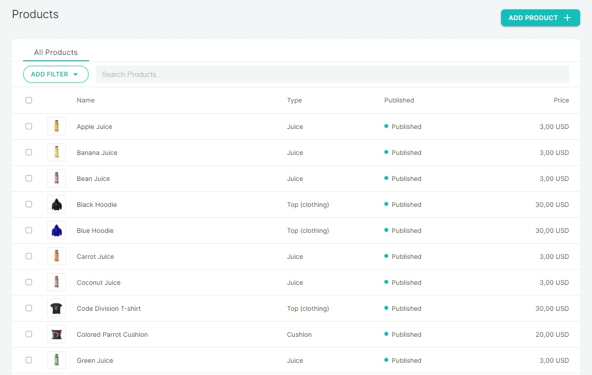

You can view all products or filter by Visibility, Stock, or Price. You can also add custom filters which will be unique to your browser:

### How to Create a New Product

Click on the [[Add Product]] button above the main list to enter the product setup page.

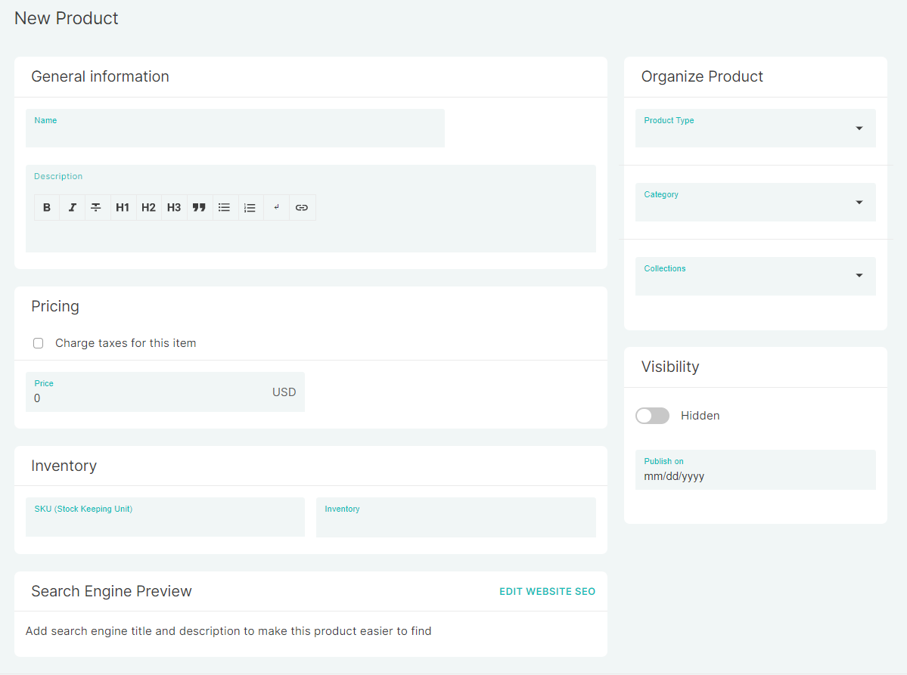

#### 1. Add General Information

Add the name of your product and a description. Use text formatting to make your product descriptions clear and engaging. The 8 basic functions are: bold type, italic type, sub-header, second sub-header, quote, bullet point list, numbered list, new text line, and add hyperlink.

> **Creating effective product names**
>
> Make sure that each product has a unique name so site users can find them easily and your administrators can easily manage your store. If you have 5 t-shirts, don’t just call them all ‘t-shirt’. Use more engaging and searchable names like black men’s t-shirt, sparkly unicorn girls’ t-shirt, red ladies t-shirt, sports t-shirt, etc. 

> **Writing a good description**
>
> Your product descriptions can be cool and fun, or just based on the facts. They represent the tone of your store. Be creative if you like, but be clear and make sure that you have all the information that a buyer needs.
>
>  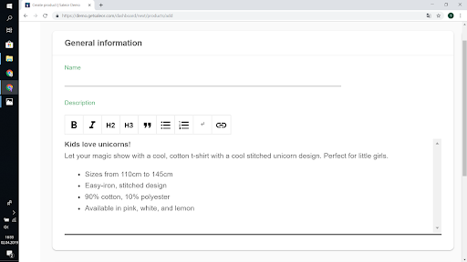

#### 2. Define Pricing

Type the price of your product manually or using the stepper by the currency indicator. If your product is tax-exempt, leave the [[Charge&nbsp;taxes&nbsp;for&nbsp;this&nbsp;item]] checkbox empty. If you need to charge taxes, click on the box and a green check mark will appear.

> **Displaying localized prices**
>
> Saleor operates and charges in the store’s default currency but is capable of displaying an estimated amount in the user’s local currency.
>
> - GeoIP is used to determine the user’s country
> - Locale database (Unicode CLDR) is used to determine the local currency
> - Open Exchange Rates is used to provide up-to-date exchange rates

#### 3. Add Optional Search Engine Preview Content

Click [[Edit&nbsp;Website&nbsp;SEO]] to add a description. If you do not add unique SEO content, details will be taken from the General Information field.

> **Help search engines find your products**
>
> Increase traffic to your store by adding SEO-friendly descriptions for search engines. Write interesting, short content about each product, using keywords that people will use in web searches. Create a unique description for each product so search engines do not think it is duplicated content.

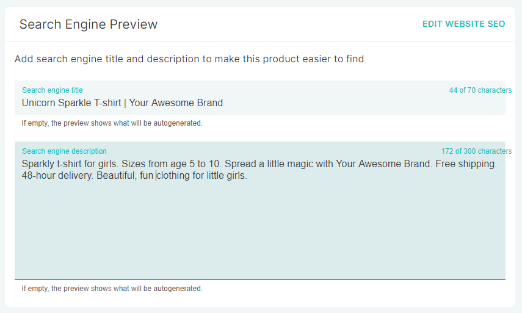

#### 4. Organize Your Product 

Categorize your new product using the drop-down menus to assign a relevant Product Type and Category. This is mandatory before you can save the product. You can also optionally assign your product to a Collection.

#### 5. Make Your Product Visible

Once you have set up all your product details, you can choose if it appears for sale or remains hidden from view. You can leave a product hidden indefinitely or sent to automatically go live at a defined time in the future by choosing a publication date.

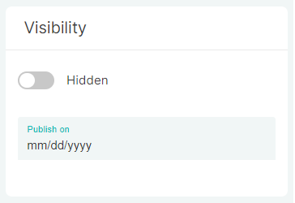

If you want to push your product for sale, click on the slider until it shows as [[Visible]].

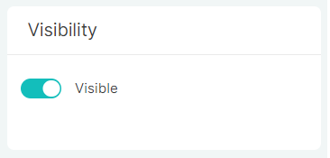

#### 6. Save Your New Product

Once you have input your minimum required product information, press [[save]] in the footer to add it to your catalog, or press [[cancel]] to exit the process and lose any new product information.

#### 7. Add Images

Much the same as on social media or other platforms, there are two ways to add an image: 

- Drag and drop a file from a folder on your computer 
- Click on [[Upload&nbsp;Image]] in the top right corner and select an image 
	
You can add an unlimited number of images per product. The main image will be the one that is first in line. You can drag and drop images to change the order. Hover over a specific image and click the trash can to delete an unwanted image.

#### 8. Add Image Descriptions

You can also add descriptions of specific product features to your images. Hover over the image and click on the pencil to edit the information. 

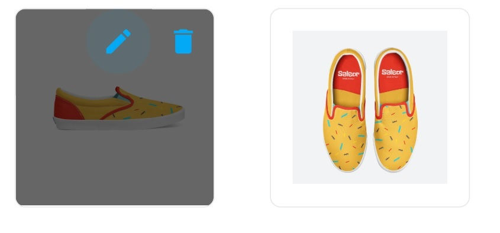

#### 9. Deleting and Editing Products

Click on an existing product from the main list and you will see the same interface as for adding products. Click [[Remove]] at the bottom of the screen to delete a product. To edit product details, just click any field and start making changes. The [[Save]] option in the footer will change color as soon as you have made amendments that need to be saved before exiting the page.

> **Save it for later**
> 
> Don’t remove a product if you just want to temporarily take it away from your inventory. In that case, just uncheck the [[Published&nbsp;in&nbsp;Storefront]] option in the Visibility section, as described above.

### Product Variants and Attributes

When you enter a product from the main list, you have all the same sections as when you create a product, with one additional field for Variants through which you can change product variants and attributes, check inventory, and control stock levels.

#### Checking Inventory

In this example, we can see five types of t-shirt. Four have enough stock to cover future orders. The XL size has a red mark and is unavailable. When we click on the product, we can see in the product variant details that the product is unavailable because there is only one item in stock (“Inventory”) and it has been ordered by a customer (“Allocated”).

#### Managing Variants of a Product

Click on a specific product from the variants list to edit the size, images, pricing, and stock. 

You can edit the cost and sale price of an item in the Pricing field.

If you receive new stock, enter the amount in the Inventory section to keep up to date and avoid false out-of-stock messages. Save any changes before exiting.

You can repeat this process for all sizes or types of the same product by clicking the Variants section on the left side. Each variant has a specific SKU code (Stock Keep Unit) and will all information is unique to specific variants.

#### Editing Attributes

When entering a product from the main list, click the [[Edit&nbsp;Attributes]] text in the top corner of the Variants field to add or change product attributes and variants. For example, a top or t-shirt will have a product attribute such as the material it is made from, and a variant attribute of the sizes or colors in which it is available.

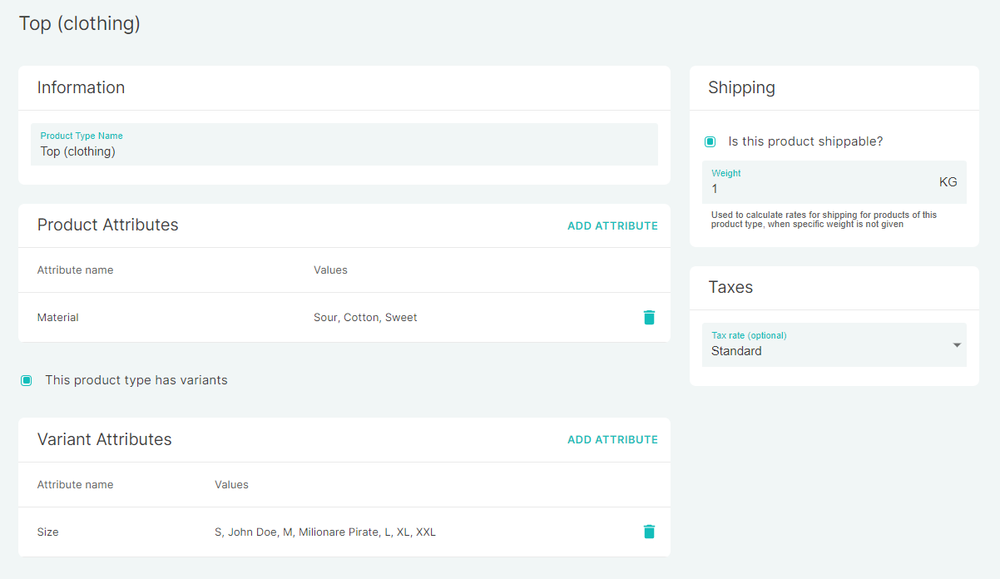

In the Product Attributes section, click on [[Add&nbsp;Attribute]]. A pop-up will appear in which you can enter new attributes. Click [[Save]] to confirm and exit.

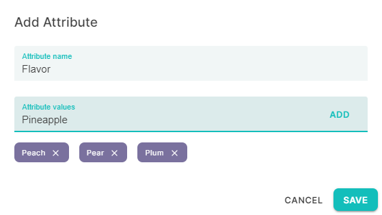

You can edit existing attributes and variants in the same way, and delete them by clicking the trash can.

## Categories

Products on the Saleor platform can be sorted by category if you sell a range of items.

### Adding a Category

Click on the [[Add&nbsp;Category]] icon to enter a new set of products. Enter the category name, description, and SEO-optimized information the same way as you would with an individual product. When finished, click [[Save&nbsp;Category]] in the bottom right corner and then add a widescreen banner photo that will appear at the top of the screen when customers view the category.

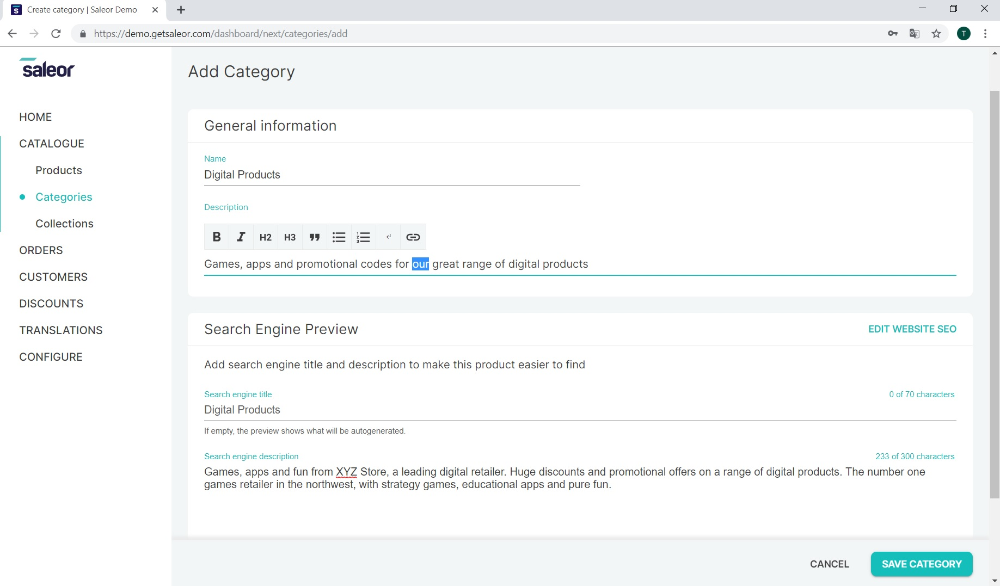

### Editing Categories

Once you have your categories, you can edit them at any time by clicking on a category from the list and changing information. When viewing a category, at the bottom of a section, you have information listing all products in the category, which can be individually clicked and edited, just as in the main products section. 

### Adding Sub-categories

Sub-categories break large groups down into smaller subsets that make it easier to manage stores and help customers find the right products. To add a sub-category, click [[Add&nbsp;Subcategory]] text in the top right corner of the sub-categories box.

In this example, we have paints and cushions in the Accessories category, which can be marked as separate sub-categories. Add a description and SEO information just the same as with a main category.

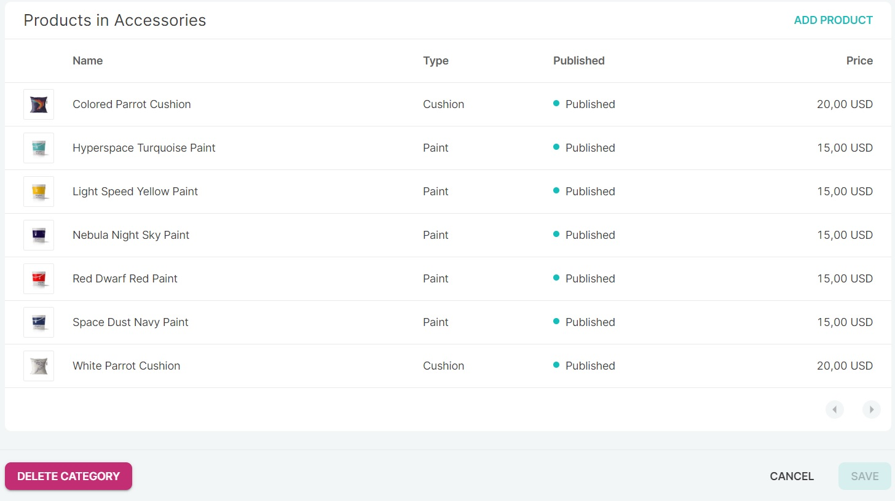

### Deleting Categories

To remove a category, simply click the [[Delete&nbsp;Category]] button in the footer 

> **Caution** 
>
> Products are mandatorily assigned to categories. Deleting a category will also remove all products it contains. Only remove a category if you are sure that you also want to permanently delete all its products from your catalog.

## Collections

Collections are a great way to increase sales and give customers better experiences. Group products together to take advantage of seasonal events or link products that are regularly bought in pairs or groups. 

### Creating and Editing Collections

You can add and edit collections in the same way as categories, with a cover photo and SEO content tailored to your collection. To delete individual products, click on the trash can next to the product and confirm removal from the collection.

### Adding Products to Existing Collections

Once you have created a collection, you can easily add more products by choosing the [[Assign&nbsp;Products]] option from the collection overview and choosing products from the list. To find other products, type the name, attribute or product type into the search bar and the list will automatically refresh.

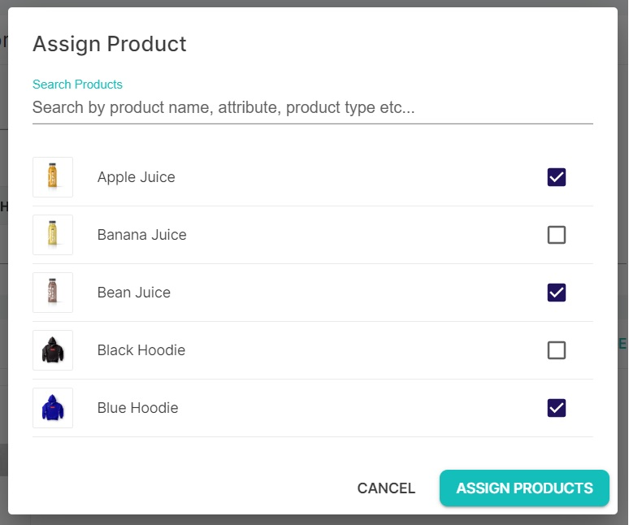

### Featured Collections

- Collections can be easily published and unpublished by clicking on the slider in the Availability section when viewing a specific collection 
- Featuring a collection will make it appear on the front page of your website
- You can only feature one collection at a time. Turning the [[Feature&nbsp;on&nbsp;Homepage]] option on for one collection will automatically turn it off for all others

### Deleting a Collection

There are two ways to remove a collection:

- Click the checkbox next to the collection name on the main list. Options to Publish, Unpublish, and Delete will appear above the list
- Click on the collection name and enter the detailed information, then use the red [[remove]] button in the footer.

Removing a collection will not delete all products from the site; it only disables the grouping of selected products and deletes information about the collection.
