The Configure section of the dashboard allows you manage your site settings, staff access, and product configurations. These are usually one-time actions that you set up and can then leave running in the background, while the other sections of the dashboard are where you take care of the dynamic, day-to-day running of your store.

## Product and Sales Configuration

### Product Types

Define the type of products you sell and organize them into groups. The Product Types list shows the type of product, a description of whether it is a physical or digital product, and which tax applies to its sale.

#### Adding a Product Type

Click on the [[Add&nbsp;Product&nbsp;Type]] icon on the right above the main product types list. The initial page has fields for Information, Shipping, and Taxes. An Attributes section also appears once the Product Type is saved.

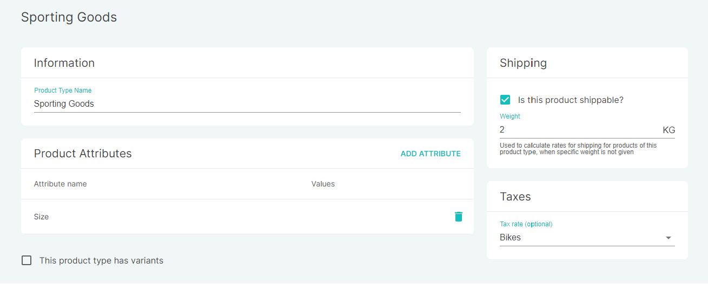

#### Information

Choose your Product Type Name. In this example, a bike comes under ‘sporting goods’.

#### Shipping

If you have physical products to send to customers, you need to check the [[Is&nbsp;this&nbsp;product&nbsp;shippable?]] checkbox. An additional section will then appear to note the weight of the products, which is essential for calculating shipping costs.

#### Taxes

Different goods are taxed differently across the world. If you leave the Taxes section blank, the system will assume that the product is classified as a standard taxable item. Click on the drop-down list to assign non-standard classifications. This is very important, as it means you are legally charging the correct amount for products. For example, educational materials may be tax exempt, while some hazardous substances have higher tax rates.

#### Adding Attributes and Variants

Once you have created your Product Type and added tax and shipping information, click [[Save]] to create the new classification. An additional field will appear for adding Attributes and Variants to the Product Type. Press [[Save]] when you have created your new attribute or variant. 

#### Removing a Product Type

There are two ways to remove a Product Type:

- Select it from the main list, then choose [[Remove]] in the footer
- Check the box on the main list and then click the trash can that appears above

Confirm the cancellation in both cases by clicking [[Delete]] in the pop-up window.

## Shipping Methods

### Defining Shipping Zones

Manage how you ship out orders. The Shipping Methods section contains two main fields: Shipping By Zone and Configuration.

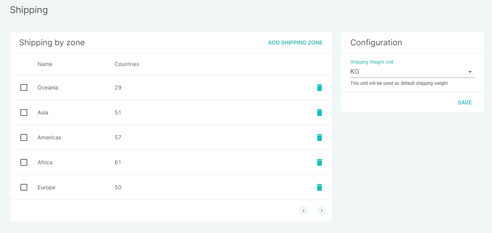

### Weight Configuration

You can choose metric or imperial weight units as the default in which your store will display products. In the Configuration section on the right, click on the triangle in the Shipping Weight Unit to choose between grams (G), kilograms (KG), pounds (LB) and ounces (OZ) as your default weight measurement.

### Adding a Shipping Zone and Assigning Countries

Shipping Zones define the cost of shipping in different areas of the world. Collecting countries together in zones allows you to assign the best shipping and delivery options for customers.

Click [[Add&nbsp;Shipping&nbsp;Zone]] in the top right corner of the Shipping by Zone field. Add the name of the shipping zone then click [[Assign&nbsp;Countries]] and use one of the three options in the pop up that appears:

1. In the Search Countries section at the top, you can add specific countries by name and assign them to the shipping zone
2. Scroll through the Countries A to Z section and assign countries using the checkboxes
3. The Quick Pick section is an option that allows you to assign all countries to a shipping zone that are not already assigned to any existing zone. This is a useful option for defining a final ‘Rest Of The World’ shipping zone to guarantee global coverage 

Click [[Assign]] to confirm your selection.

### Removing Shipping Zones And Countries

You can remove individual shipping zones by entering the zone from the list and clicking [[Remove]] in the footer. To remove multiple zones, click the checkboxes and the main list and then confirm using the trash can that appears above the list.

Remove countries from a shipping zone using the trash can icon next to the country name when you enter a specific zone from the main list.

## Adding Shipping Rates

Find rates offered by couriers for the delivery of your goods and add them to your shipping zones. When your customers get to the checkout section of the store, they will be presented with these shipment options and prices.

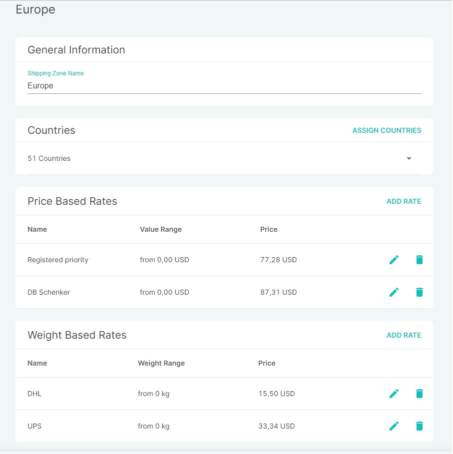

There are two types of shipping:

- Price-based shipping defines the cost based upon the value of goods
- Weight-based shipping defines cost by weight

### Adding a Courier

1. Click [[Add&nbsp;Rate]] in the appropriate field. 
2. Fill the name of the courier in the Rate Name field.

3. Define if there are minimum and/or maximum weight or price values put in place by couriers. If there are no limitations, click the slider until it turns green. If there are limitations, input them into the fields as the value range. If you leave the minimum value empty, it means that there is no lower threshold. If you leave the maximum value empty, it means there is no maximum weight or price value.

### Free or Paid Shipping

If you offer free shipping, click on the slider until it is green. If shipping is charged, input the rate per weight unit in the currency field.

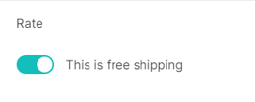

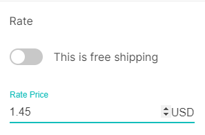

### Removing Couriers

Remove couriers from specific shipping zones by entering the zone and clicking the trash can next to the courier you want to remove. 

## Taxes

Saleor uses an API to help automate taxes. There are very few actions that you need to take, apart from assigning the correct tax band to any Product Type that you create. 

In the main Taxes screen, you need to check or uncheck three boxes in the Configuration field to decide how taxes apply and are displayed in your store:

- All products prices are entered with tax included
- Show gross prices to customers in storefront
- Charge tax on shipping rates

Once you choose these according to how your store works and click [[Fetch&nbsp;Taxes]], the entire Saleor storefront will re-calibrate to take your preferences into account.

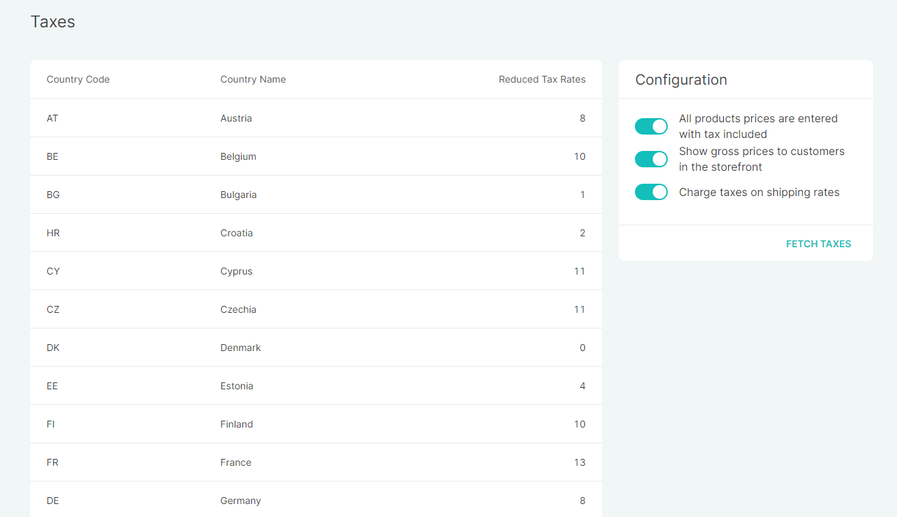

Saleor uses a program that automatically retrieves tax information for each country. Click on a country from the list on the Taxes page to see a list of non-standard taxes that are applied in that territory, as well as a box on the right side that shows the national standard tax rate for all other goods.

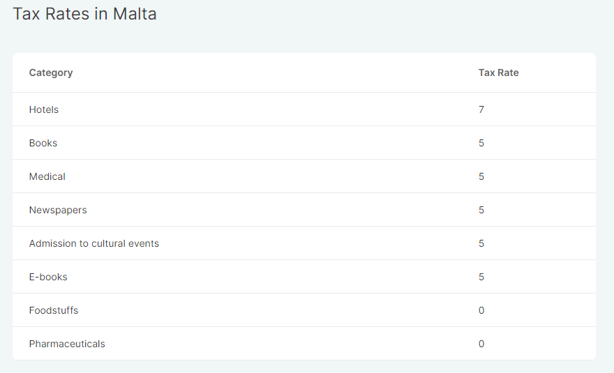

## Staff Members

Manage your employees and their permissions. The Staff Members section gives you an alphabetized list of all people who have administrative access to your dashboard.

### Adding Staff Members

Click on [[Add&nbsp;Staff&nbsp;Member]] above the list of users. Fill in the first and last name of the new staff member and the email address to which any notifications will be sent.

### Setting Permissions

In the example above, the Permissions section has the box checked which reads [[User&nbsp;has&nbsp;full&nbsp;access&nbsp;to&nbsp;the&nbsp;store]]. If you want to limit access, uncheck the box and a list of different possible administrative activities will appear. Use the checkboxes to assign specific permissions to the user.

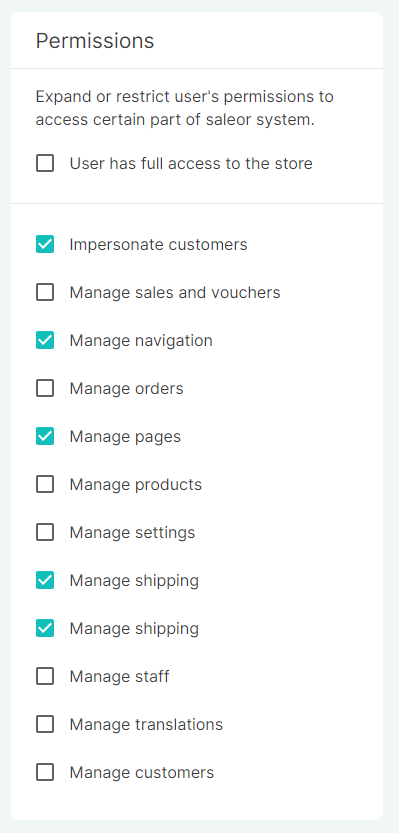

### Account Status

New users are automatically active in the system. To deactivate a user’s access without deleting the account, uncheck the [[User&nbsp;is&nbsp;Active]] box in the Account Status field.

### Editing and Deleting Users

To edit a user account, access it from the staff members list, make any relevant changes, and then press [[Save]] in the footer.

To delete a user, click [[Remove]] on the left side of the footer bar and then confirm removal.

## Site Settings

### General Information

View and update your site settings to control how your site information appears online.

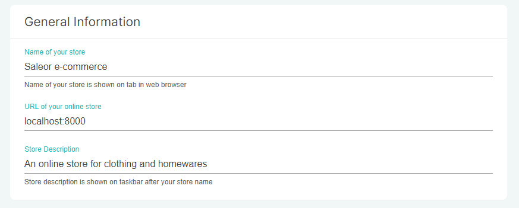

The text you input to the [[Name&nbsp;of&nbsp;your&nbsp;store]] field will appear in web browser tabs and at the beginning of browser results.

The [[URL&nbsp;of&nbsp;your&nbsp;online&nbsp;store]] should match that which you will send to customers and web browsers.

The [[Store&nbsp;Description]] is SEO information that will appear in browser results listing your site, so make sure it has clear, useful copy about your store and its products.

### Authentication Keys

You can allow dashboard users to enter your store through Google and Facebook and add additional security keys to ensure site security. 

1. Click [[Add&nbsp;key]] at the top right of the Authentication Keys section 
2. Choose Facebook or Google from the dropdown menu 
3. Enter a key and password, which users will enter when accessing the dashboard through the chosen platform 
4. Press [[Add&nbsp;Authentication]] to confirm

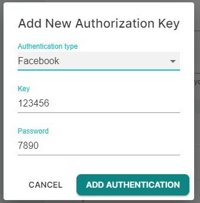

## Pages

In the footer of your main storefront, you can display informational pages with content about your store, your team, terms and conditions, privacy information, and other useful details. These simple text pages enhance the image of your business and sometimes contain essential legal information you need to communicate to customers.

To add pages, click on the [[Pages]] field in the Configure section of the dashboard. 
Click [[Add&nbsp;Page]] at the top right.

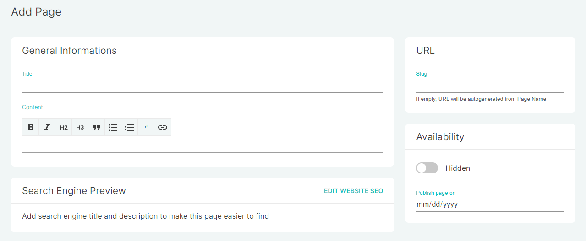

### General Information

Fill in the title of the page, as it will appear in the footer of your store. Keep it short, preferably just a word or two. 

Add the content that the page will contain. This may be a simple description of your store or a full terms and conditions section. Use the word processor formatting tools to adjust font sizes, add hyperlinks, and style the page as you want it to appear.

### Search Engine Preview

Click [[Edit&nbsp;Website&nbsp;SEO]] to add a description that will appear in web searches.

### URL

If you leave the URL section empty, the title of the page will be added to your normal site URL after a slash. You can change the site address after the slash by typing it into the URL section.

### Visibility

You can choose if your page is published or not. If the slider is green, it is live on your website. If the slider is grey, you can leave the page hidden or set a future date when it will be published.

### Deleting Pages

To delete a page, click on the checkbox next to the page name on the list, then click the trash can. Alternatively, you can enter the page and then click [[Remove]] in the footer.

## Navigation

The navigation section allows you to configure what information is visible on the header and footer navigation bars of your website. 

### Creating Your Navigation Structure

Creating the navigation structure is done by dragging and dropping. Simply create a new menu item and then drag it to the desired place. You can move items inside one another to create a tree structure and drag items up and down to create a hierarchy.

When you have more than one layer, the property to the far left will appear as the main item  and the indented items become sub-elements, as in the following example.

What you'll see in the dashboard:

How it will appear on your storefront:

### Managing Navigation Items

You can easily view, edit, or remove menu items using the icons on the right side of the sliders. 
