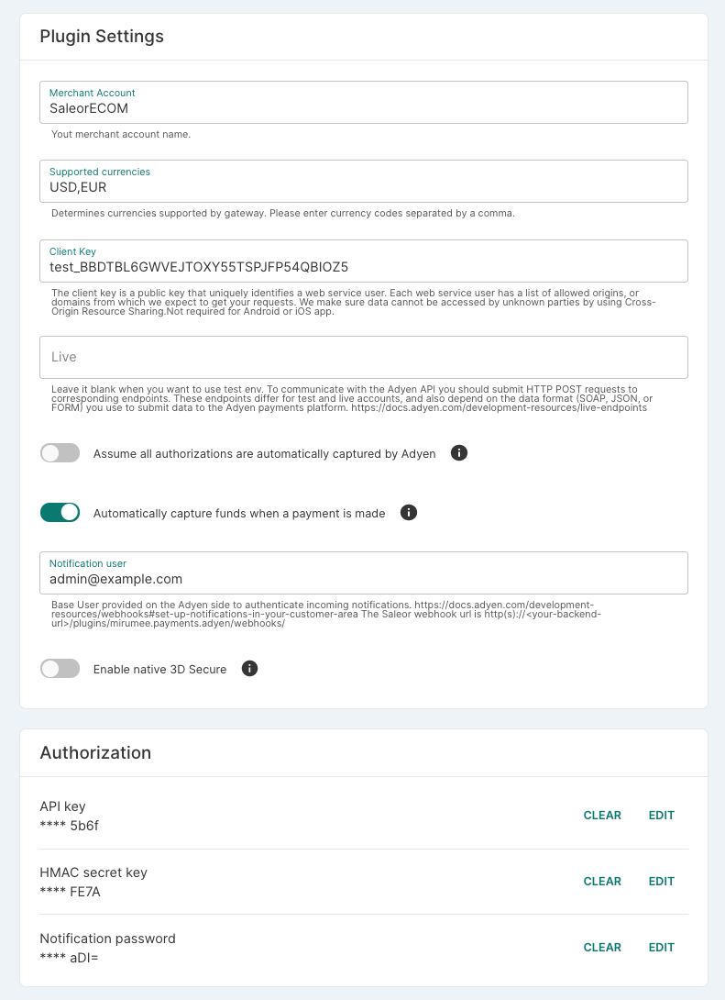

## Introduction

This page gives you a convenient overview of currently installed plugins in Saleor.
Saleor provides the possibility to add various extensions to it so you can create your own configuration.

The plugin page is used to display general information about installed plugins, along with their activation status (active or not active).

If you choose to, you can use the plugin window to display the basic configuration to allow dashboard users to manage the elemental settings of existing plugins.

For more detailed information about plugins and our Extension Manager, see the [Extending](../../developer/extending) topic in the chapter for developers.

Saleor arrives with the following plugins already integrated.

- Used to configure taxes in Saleor:

  - Avalara

  - Vatlayer

- Used to process payments (all supported payment gateways in Saleor come as plugins):

  - Adyen

  - Braintree

  - Razorpay

  - Stripe

- Used to provide certain core features:

  - Invoicing

  - Webhooks

In all cases of plugin configuration, you need to provide your credentials. Depending on the gate you are configuring, there might be additional setup required.

## Adyen

### Enabling the Adyen integration

Go to _Configuration_ -> _Plugins_ -> _Adyen_ and fill in the fields:

- **Merchant Account:** your Adyen account identifier as described in the [getting started with Adyen guide](https://docs.adyen.com/checkout/get-started#step-1-sign-up-for-a-test-account)

- **Supported currencies:** your currency as an ISO 4217 3-letter code (eg. `USD`, `EUR`, `GBP`)

- **Client Key:** The client key is a public key that uniquely identifies a web service. See [Adyen docs](https://docs.adyen.com/user-management/client-side-authentication#get-your-client-key).

- **Origin URL:** The origin URL of the page where you are rendering the Adyen Drop-in. The origin URL of the page where you are rendering the Drop-in. This should not include subdirectories or a trailing slash. For example, if you are rendering the Drop-in on `https://your-company.com/checkout/payment`, put in: `https://your-company.com` as the origin. See [Adyen docs](https://docs.adyen.com/checkout/drop-in-web).

- **Live:** Leave it blank if you want to use the test environment. See [Adyen docs for production environments](https://docs.adyen.com/development-resources/live-endpoints).

- **Assume all authorizations are automatically captured by Adyen:** All authorized payments will be marked as captured. This should only be enabled if Adyen is configured to auto-capture payments. Saleor doesn’t support the _delayed capture_ Adyen feature.

- **Automatically capture funds when a payment is made:** If enabled, Saleor will automatically capture funds. If disabled, the funds are blocked but need to be captured manually.

- **HMAC secret key:** key used to check if a received notification comes from Adyen. The key should be the same as on the Adyen side. Generate a new key in the Adyen customer area and copy it here. See [Adyen docs](https://docs.adyen.com/development-resources/webhooks#set-up-notifications-in-your-customer-area).

- **Notification user:** In addition to checking request signatures, you can confirm received notification by checking the provided user in the notification. Provide a user in the _Authentication_ section of your Adyen customer area and copy it here. See [Adyen docs](https://docs.adyen.com/development-resources/webhooks#set-up-notifications-in-your-customer-area).

- **Notification password:** In addition to checking request signatures, you can confirm received notification by checking the provided user’s password in the notification . Provide a password in the _Authentication_ section of your Adyen customer area and copy it here. See [Adyen docs](https://docs.adyen.com/development-resources/webhooks#set-up-notifications-in-your-customer-area).

Below you can find an example configuration of the Adyen plugin:

### Activating the Adyen notification

Adyen uses a notification system that can be used to update the payment information on the Saleor side.  Enabling the notification requires some additional steps on the Adyen's customer area panel side. See [Adyen docs](https://docs.adyen.com/development-resources/webhooks#set-up-notifications-in-your-customer-area) for more details.

The URL that you need provide on Adyen side is `https://<your-backend-url>/plugins/mirumee.payments.adyen/webhooks/`.

To protect your notification endpoints make sure that you enabled the HMAC signature and basic authentication [Adyen docs about security]([https://docs.adyen.com/development-resources/webhooks/best-practices#security]). [See Saleor configuration fields](#enabling-the-adyen-integration)