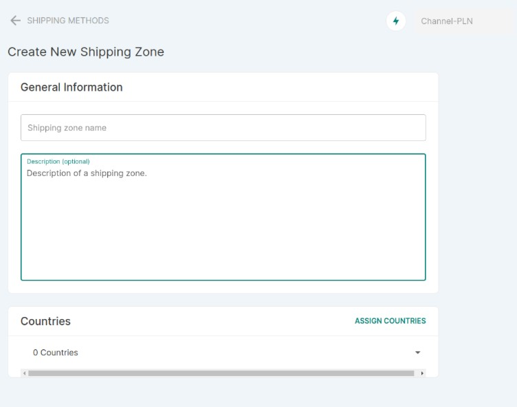
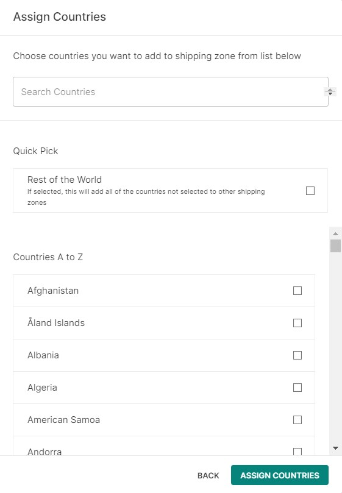
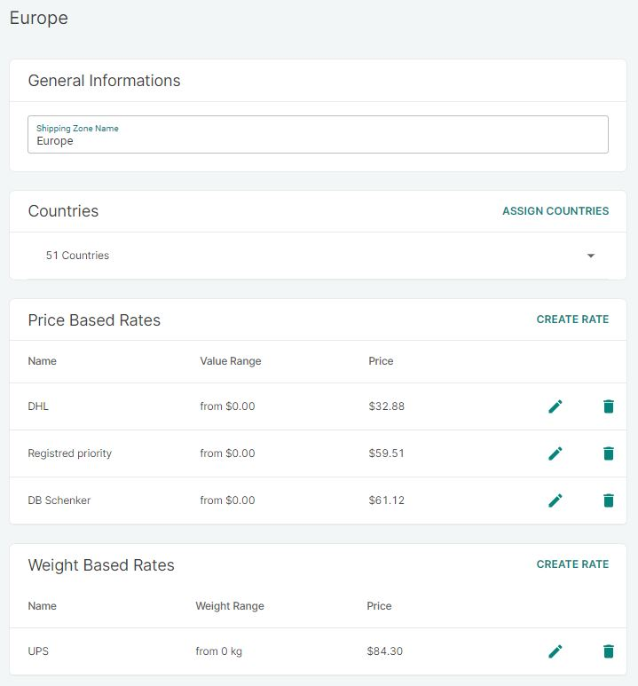
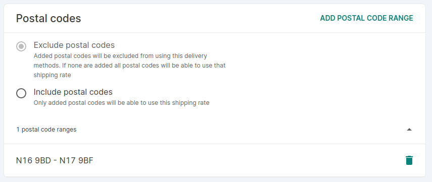
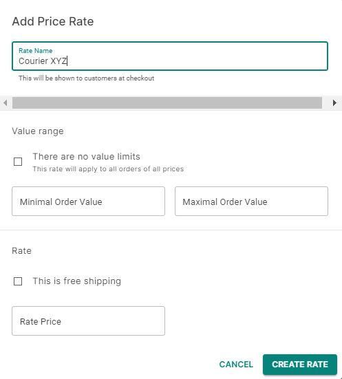

## Defining shipping zones 

On this page you can manage how you ship out orders. The Shipping Methods section contains two main cards: Shipping By Zone and Configuration.

## Weight configuration

You can choose metric or imperial weight units as the default in which your store will display products. In the Configuration card on the right, click on the triangle in the Shipping Weight Unit field to choose between grams (G), kilograms (KG), pounds (LB) and ounces (OZ) as your default weight measurement.

## How to

### How to create a shipping zone and assign countries

Shipping Zones define the cost of shipping in different areas of the world. Collecting countries together in zones allows you to assign the best shipping and delivery options for customers.

To create a shipping zone, first you need to click _Create Shipping Zone_ in the top right corner of the Shipping by Zone card. The next step is to provide the name and description (optional) of the shipping zone. 

Then click _Assign Countries_ and use one of three options that appear in the pop-up window:

1. In the Search Countries section at the top, you can search specific countries by name and assign them to the shipping zone.
2. The Quick Pick section is an option that allows you to create a shipping for all unassigned countries. This is a useful option for defining a final ‘Rest Of The World’ shipping zone to guarantee global coverage.
3. Scroll through the Countries A to Z list and assign countries using the checkboxes.

Click _Assign Countries_ to confirm your selection.

### How to remove shipping zones and countries

You can remove individual shipping zones by entering the zone from the list and clicking _Remove_ in the footer. To remove multiple zones, click the checkboxes on the main list and then confirm using the trash can icon that appears above the list.

Remove countries from a shipping zone using the trash can icon next to the country name when you enter a specific zone from the main list.

### How to add shipping rates

Find rates offered by couriers for the delivery of your goods and add them to your shipping zones. When your customers get to the checkout section of the store, they will be presented with these shipment options and prices.

There are two types of shipping:

- Price-based shipping defines the cost based upon the value of orders and pricing per channel. Can be used when the order price falls within a certain range. For example, from $0 to $50 - shipping method A, over $50 - shipping method B, etc.
- Weight-based shipping defines cost by weight. Similar to the price based example.

These two methods cover most of the basic use cases, for example:

* Listing several methods with different prices and shipping time for different countries.
* Offering a free (or discounted) shipping on orders above certain price threshold.
* Increasing the shipping price for heavy orders.

### How to add a channel to the shipping rate type

In both shipping rate types mentioned above, you can assign sales channels. Click the _MANAGE_ button in the right top corner of the availability card, and then assign a channel. You can select multiple channels. 

### How to exclude the products  
Once the shipping rate has been created, you can exclude products from it. Click _ASSIGN PRODUCTS_ in the Excluded Products card of the shipping rate details page.

### Postal codes

This section allows you to limit the shipping zone to shipping addresses within or outside of certain postal code ranges.
In the *include* mode, only shipping addresses within the specified ranges are considered part of the shipping zone. In the *exclude* mode, shipping addresses within the specified ranges are considered outside of the shipping zone.

Currently, the only supported mode for postal codes is the *exclude* mode. Support for inclusion will be added in a future release.

Postal codes are compared using alphabetical sorting (start range ≤ customer postal code ≤ end range) with the following exceptions:
- Great Britain: alphabetical order except for area codes that are sorted as numbers (for example, the range *BH1 1AA* - *BH3 9ZZ* does not include *BH21 2BC* even though alphabetical order would suggest otherwise).
- Ireland: alphabetical order except for routing keys that are sorted as numbers.
- Isle of Man, Jersey, Guernsey: same rules as Great Britain.

### How to add a courier

1. Click _Create&nbsp;Rate_ in the Price Based Rates card.

2. Put the name of the courier in the Rate Name field.

3. Define if there are minimum and/or maximum weight or price values put in place by couriers. 

    * If there are no limitations, select the There are no value limits checkbox. 

    * If there are limitations, input them into the fields as the value range. If you leave the minimum value empty, it means that there is no lower threshold. If you leave the maximum value empty, it means there is no maximum weight or price value.

#### Free or paid shipping

If you offer free shipping, select the _This is free shipping_ checkbox. 

If shipping is charged, input the rate per weight unit in the currency field.

### How to remove couriers

Remove couriers from specific shipping zones by entering the zone and clicking the trash can icon next to the courier you want to remove.

### How to manage metadata

Once the shipping zone has been created, you can add private and public metadata for each shipping zone in the shipping zone details page. Use the button _Add Field_ to add a new metadata field.

To learn more about object metadata, see the [Developer's Guide](developer/metadata.mdx).
