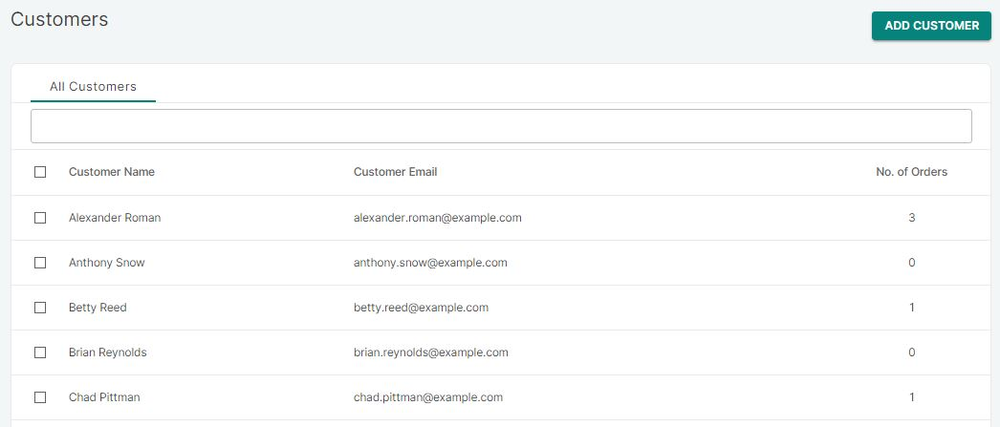
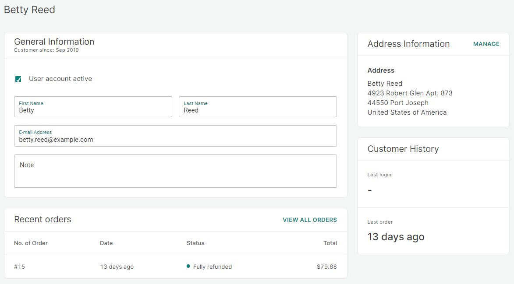

## Introduction

On this page, you can view the details of all users who have provided you with their information when setting up an account or placing an order.

Click on an individual customer to get an overview of the general information, address, customer activity, and recent orders.

## Customer orders and history

The Customer History card gives a brief overview of customer activity. You can view a single order or all orders of a specific customer by clicking in the Recent Orders card. From there you can amend and take actions as described in the [Orders](dashboard/orders.md) section of these documents.

## Managing customer addresses

Click _Manage_ in the Address Information card to edit or delete a customer address. Click the three dots in the top right corner of a specific address, to set it as the default shipping or billing address.

Use the _Add&nbsp;Address_ button in the top right corner of the Address Book page if a customer asks the administrator to manually add an address. When a customer has more than one address listed, it is important to assign the correct billing and shipping addresses, as described above.

:::note Localized addresses

When creating addresses in different countries, Saleor uses Google’s address internationalization database to automatically validate addresses (in both local language/script and their latinized version: “北京” vs. “Beijing”).

Saleor can also provide front-end code with information on:

- Which fields should be visible
- How the fields should be arranged
- What field labels to use (“zip code” vs. “postal code”, “state” vs. “district”, etc.)

:::

## How to

### How to add a customer

Click _Add Customer_ to open a new Add Customer page. Enter the customer’s main details in the Customer Overview card. Use the Primary Address card to supply more contact details (company name, shipping address, and phone number). There is also a Note card if you need to enter additional customer information.

Click _Save_ to proceed. Your new customer is now set up in the system and you are redirected to this customer’s overview page.

### How to edit general information

Make changes to the customer name and e-mail by simply typing into the relevant field in the General Information card. The _Save_ button in the footer will activate once changes that need to be confirmed have been made.

In the General Information card, there is a checkbox next to the text _User&nbsp;account&nbsp;active_. Accounts will be active as soon as they are created but you can check the box to suspend a customer account, for example, if you suspect malicious activity.

If you have implemented a backend protocol that requires users to confirm account activation from an e-mail, which is not a default feature, this may also be useful if a user has issues with replying to the e-mail and asks for a manual activation.

### How to remove a customer

Select the specific customer record from the main list. Click _Delete_ in the footer then confirm the action.

Users are also able to request their account to be deleted, from the storefront level, on their user profile settings. In such cases, a confirmation email is sent to the email address associated with the account.

:::note GDPR Compliance

In compliance with GDPR laws in Europe, clicking _Delete_ in the Customer card will delete the customer's profile, in other words, the customer's account instance.

All data used for the checkout process are left untouched. This is to keep track of financial transactions.

This solution satisfies the GDPR requirements.
However, Saleor, and its creators do not bear responsibility for your compliance with legal protocols. Check the law in your local area and make sure that you comply with all data processing legislation.

For more details on data protection implementation in Saleor, see our [GDPR](dashboard/systemwide/gdpr.md) topic.

:::
