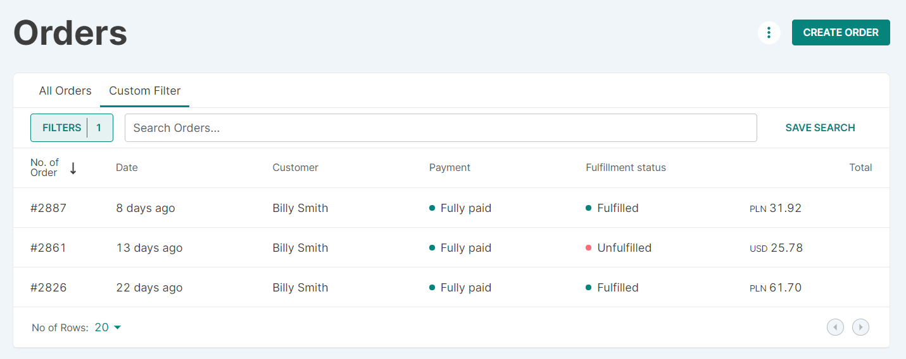
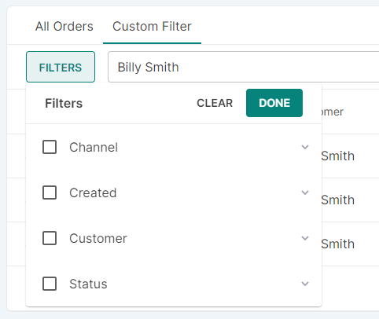
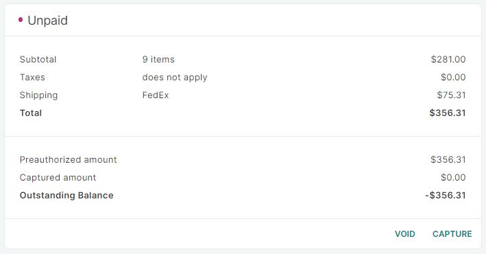
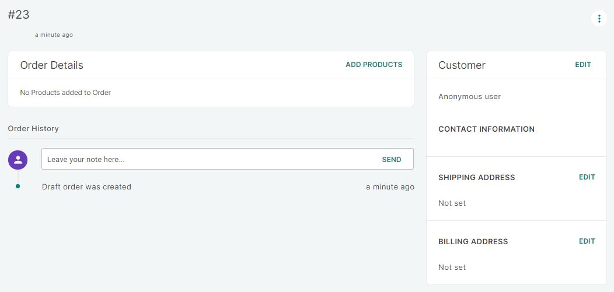
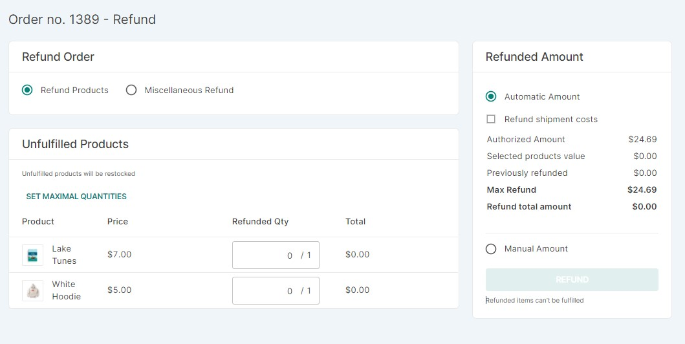
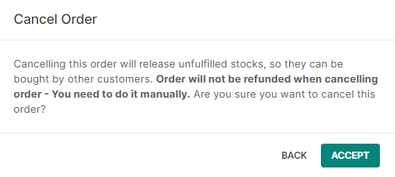
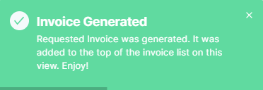

## Introduction

The Orders section shows you all orders placed through Saleor. An order is created once a customer completes the checkout process.

## Order types

There are essentially two order types in Saleor:

- Regular orders - Orders created by your customers.

- Draft orders - These are orders created by administrators, which have not yet been released to the system. For example, store operators can create orders during discussions with customers, then save them as drafts until approval is gained from management to send replacement goods. You can edit draft orders the same way that you create an order.

- Unconfirmed orders - Orders placed by customers [when order confirmation feature is turned on](#settings). The payment on such orders is being authorized when order is placed but captured later - when staff [confirms the order](#how-to-confirm-an-order).

To process an order in the system, click _Finalize_ in the footer. Once the order is finalized, stock inventory will be affected. Unreleased draft orders do not influence actual or predicted stock levels.

## Order list page

The main page shows a list of all orders in the system, regardless of their status.

### Order filters

To automatically filter orders, click _Filters_ and view orders by channel, date, customer or fulfillment status. Sorting by _status_ brings up a second menu from which you can choose _Cancelled_, _Fulfilled_, _Partially Fulfilled_, _Unfulfilled_, _Ready to capture_, _Ready to fulfill_.

You can also manually search specific information, such as key words or names, using the _Search Orders_ field. The filter is dynamically applied as you type.

## Order settings

:::note These options were introduced in Saleor 3.1 (alpha version). We recommend using the latest Saleor 3.0 version for production.
:::

The order settings page allows you to manage your order and fulfillment settings.

### How to access the order settings page
Click the three dot icon on top of the right corner of the main order list page. Then click _Order Settings_.

### Settings
Under the _Settings_ section, you can set automatic confirmation for all orders and fulfillment of non-shippable gift cards.

- **Automatically confirm all orders** - If you select automatic confirmation, all orders will be automatically confirmed and all payments will be captured.

- **Automatically fulfill non shippable gift cards** - If you select automatically fulfill non-shippable gift cards, activated non-shippable gift cards will be automatically set as fulfilled and sent to the customer.

### Fulfillment settings
Under the fulfillment settings section, you can set automatic approval for all fulfillments and the ability to fulfill products without capturing payment for the order.

- **Automatically approve all fulfillments** - If you select this option, after choosing a warehouse for an order, click the fulfill button in the fulfillment card and to automatically fulfill the order. Not selecting automatic approval for all fulfillments will require additional approval. After choosing a warehouse for an order, you need to click the _Prepare Fulfillment_ button in the fulfillment card. Then you need to manually approve the order by clicking the approve button in the order details page.

- **Fulfillment wihout payment** - If you select this option, you will be able to fulfill products without capturing payment for the order. Not selecting this option will require capturing payment for the order before fulfillment.

## Order details page

Click on any order record from the list to get the full details. The order page contains cards indicating order fulfillment status, payment stage, order history, customer details, and notes.

### Order fulfillment card

The fulfillment represents a group of shipped items with a corresponding tracking number. Fulfillments are created by a shop operator and usually represent physical shipments.

Fulfillment means whether an order has been sent to the customer or not. Some orders will only have a single _Unfulfilled_ or _Fulfilled_ card. Others, as in the example below, will have both cards if parts of the order have been sent to the customer but other products are yet to be dispatched.

When creating a fulfillment, you will have the option to select which warehouse(s) to use. If multiple warehouses are used, a separate fulfillment will be created for each warehouse.

#### Fulfillment statuses

There are five possible order statuses (and a _Draft_ one), based on the stage of their fulfillment:

- **Unconfirmed** - Used when the user finishes checkout and order confirmation is required (can be changed in order settings). After the order is confirmed by staff, it becomes _Unfulfilled_.

- **Unfulfilled** - It means there are no fulfillments related to an order, or they are all canceled. An action by a shop operator is required to continue order processing.

- **Partially fulfilled** - There are some fulfillments with _Fulfilled_ status related to an order. An action by a shop operator is required to continue order processing.

- **Fulfilled** - Each order line is fulfilled in existing fulfillments. Order doesn’t require further actions by a shop operator.

- **Cancelled** - Order has been canceled. Every fulfillment (if there is any) has _Cancelled_ status. Order doesn’t require further actions by a shop operator.

- **Draft** - It is used for newly created orders from the dashboard that have not yet been published.

### Order payment card

Orders are managed and processed in relation to their payment status. So each order status is closely linked to the processing stage of payment. There are the following payment stages:

- Unpaid - It reflects the traditional credit card or payment awaiting authorization from the bank. Unpaid amounts are listed as ‘pre-authorized’. Once funds are released, the order status will change to "fully paid".

- Fully paid - It indicates that the order has been paid for in full.

- Fully refunded - All charged funds were returned to the customer.

- Partially refunded - It reflects issuing a partial refund to a customer. That happens, for example, when one product out of several ordered, is no longer available.

#### Authorization and capture

Some of the payment backends support pre-authorizing payments.

Authorization and capture is a two-step process.

First, the funds are locked in the payer’s account but are not transferred to your bank.

Then, depending on the gateway and card type used, you can charge the card for an amount not exceeding the authorized amount.
Note that the card may be charged within a few days to a month from when the funds were initially locked.

It is very useful when an exact price cannot be determined until after the order is prepared, or you want to capture the money as soon as you ship the order. It is also helpful if you prefer to screen orders manually for fraud attempts.

When viewing orders with pre-authorized payments, Saleor offers options to either capture or void the funds. You can capture the total or partial amount (for example, taking only partial payment for an item due to damage, late delivery, or customer service issues) by clicking _Capture_ in the bottom right corner and then confirming the total amount or changing the price to the new amount agreed with the customer.

#### Refunds
Payments can be fully or partially refunded if there is an issue with the goods or customer service.

### Order history

Every time you complete an action, such as confirming and fulfilling an order, a note appears in the order timeline at the bottom of the page. Administrators can add notes about interactions with clients and other information for other store workers.

### Customer details

The customer information in the card to the right of the screen on a specific order is automatically generated when the customer completes a transaction. The billing and shipping addresses can be edited if necessary. There is also an option to directly contact the customer via email by clicking on the web address shown on the contact information card.

### Notes

This card displays any additional information or remarks your customer made when placing the order.

## How to

### How to create an order

It is a function for store administrators to add orders, usually in cases where customer orders need to be re-sent but have already been fulfilled in the system. For example, if the customer was sent damaged goods or is being sent a complimentary product due to customer service issues. You can also use it to create dummy test orders or to deal with stock issues.

1. Click _Create&nbsp;Order_ on the main orders page or the draft orders section.

2. Choose a previously created [channel](dashboard/configuration/channels.md).

3. Click _Add&nbsp;Products_ in the Order Details card.

4. Select products from the drop-down menu or by typing the product name in the search field. Assign using the check boxes.

5. Choose the customer name. Other fields for customer information will then auto-complete. Make any required changes or input information for a new customer.

6. Choose the best shipping offer from the drop-down list of available couriers.

Once you set up the order and finalize it using the button in the footer, it becomes a regular order, so you can now send the replacement goods to the customer.

### How to confirm an order

When order confirmation is enabled, an order needs to be confirmed by staff to become unfulfilled.

1. Select an unconfirmed order from order list to open the order details.

2. You can edit the order at this stage. However, there are a few things to be aware of when doing so:

- When you change the order address, existing allocations remain untouched.
- When you increase the order line amount or add a new order line, new allocations are created.
- Allocations will only get altered for variants with [active inventory tracking](dashboard/catalog/products.md#managing-variants-of-a-product) set.
- When you delete the order line, all existing allocations of that order line are deleted with it.
- An insufficient stock error will be displayed if you try to create/increase the amount on an order line with more variants than what is available.
- When manipulating order lines after the order address changes, you may be unable to allocate the items to a new address. The reason for that may be the insufficient stock in the warehouse that would get selected for the new address.

3. Click _confirm&nbsp;order_ button on the bottom

After operation is finished, order status should be _unfulfilled_.
Keep in mind that staff might change the order value before it's confirmed by manipulating the order lines. If such case happens, then after the confirmation, charged amount can be:
- Higher than order total - staff should perform [miscellaneous refund](#how-to-refund-an-order) for the amount that was overpaid.
- Lower than order total - staff should decide with the customer how to handle the outstanding balance.

### How to refund an order

Saleor allows you to refund payments. Click the _REFUND_ button in the _Fully paid_ card in the order details page. 

There are two options to choose:
1. _Refund Products_. This method allows you to choose the quantity of the refunded products. Click the _SET MAXIMAL QUANTITIES_ button to select all products from the order that will be refunded. 

In the _Refunded Amount_ card, you can choose if you want to use an _Automatic Amount_ or _Manual Amount_. The first one is calculated based on the quantity of the products for the refund you selected earlier. You can also refund shipping costs (optional). _Manual Amount_ allows you to type any amount you have decided. 

2. _Miscellaneous Refund_. This option allows you to type any amount for the refund you have decided.

### How to fulfill an order

To fulfill an order click _Fulfill_ in the Unfulfilled card and use the stepper to confirm which products are being sent.

Use the form to select how much of each product you want to fulfill from which warehouse. It's possible to only partially fulfill an order by not entirelly allocating the quantity to fulfill for some of all of the order lines. If multiple warehouses are used, Saleor will create a separate fulfillment for each used warehouse.

### How to cancel, return and replace an order

#### How to cancel an order

Click the three dots in the top right corner of a Fulfilled order card. Choose the *Cancel Order* option. Then click *Accept* when the pop-up appears. Items will be restocked into the Saleor system.

#### How to return and replace an order
Click the three dots in the top right corner of a Fulfilled order card. Choose the _Return/replace order_ option. Then select the quantity of the items that need to be returned or/and replaced. Additionally, you can refund money while returning items.

The last step is to click the _Return & Replace Products_ button.

If you only select the _Return_ option, the item will be found under the _Returned_ section of the order details page. If you choose the _Return_ and _Replace_ options, the item will be under the _Replaced_ section.

After choosing the replace option, Saleor will create a new draft order to replace the item. If the original order hasn't been fulfilled, the product will be automatically restocked in your warehouse. If the order has been fulfilled and you haven't canceled the fulfillment, the item won't be restocked automatically; you will have to do that manually on the variant details page of the product.

#### A return and replace use case

A customer buys a pair of new shoes. It turns out that they are too big. The customer decides to return them and asks for a smaller size. In this case, the store manager uses the Return & Replace option from the order details page to replace the shoes.

### How to generate an invoice

To create an invoice for an order, click _generate_ on the right side of the order details page.

You will receive a notification on the right-hand side once the invoice has been generated. You cannot remove the invoice from the order after it has been generated.

To send an invoice to the customer, click the _send_ button.

### How to manage metadata in the order setup page

You can add private and public metadata for each order in the order setup page. Use the button _Add Field_ to add a new metadata field.

To learn more about object metadata, see the [Developer's Guide](developer/metadata.mdx).
